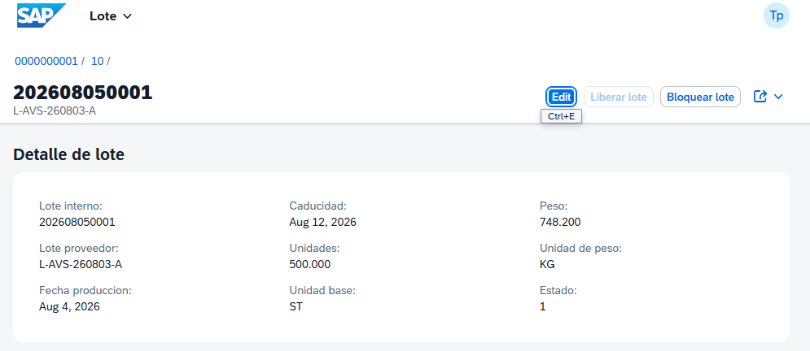
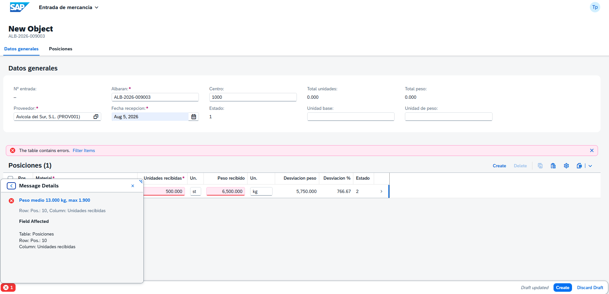
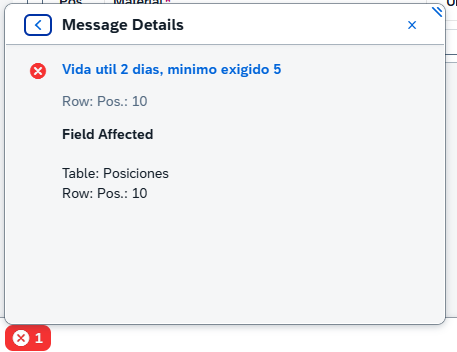
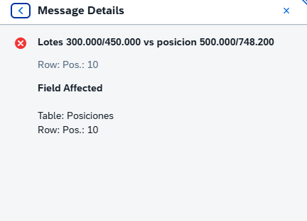
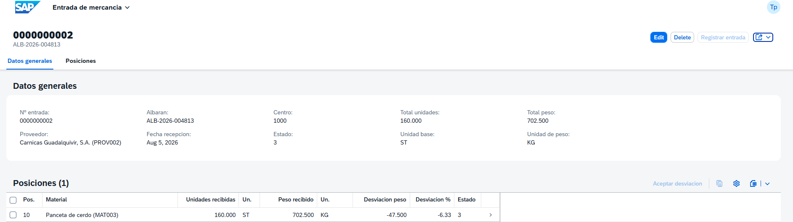
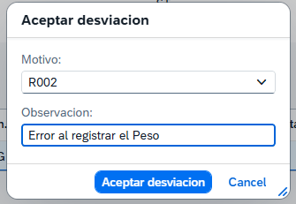
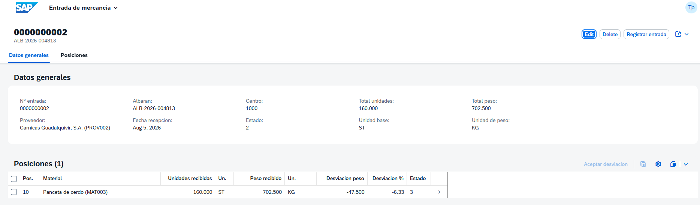
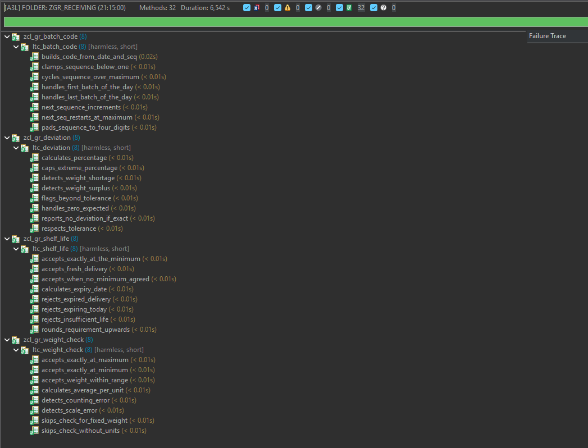
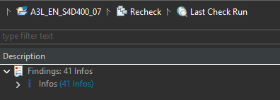

# Entrada de mercancía con gestión de lote y doble unidad de medida

Business object **RAP** sobre **SAP BTP ABAP Environment** que modela la recepción de mercancía en
una planta de industria cárnica: verificación contra documento de entrada, registro simultáneo en
unidades y kilos, asignación de lote con fecha de caducidad, y regularización de discrepancias con
motivo.

`ABAP Cloud` · `RAP managed con draft` · `CDS view entities` · `OData V4` · `ABAP Unit`

---

## 1. Qué problema resuelve

En una planta de producto fresco, una recepción no se cierra contando bultos.

Cada palet entra con **dos cantidades a la vez** —unidades y kilos— porque cada pieza pesa distinto,
y ninguna se puede deducir de la otra: 500 pollos pueden ser 550 kg o 950 kg. A eso se suma que la
mercancía llega con un lote de proveedor que hay que enlazar con el lote interno de fábrica, y con
una fecha de caducidad que decide el orden en que ese producto saldrá después.

Cuando el peso de la báscula no cuadra con el del albarán, alguien tiene que decidir en el muelle si
eso es una merma asumible, un error de conteo o un problema con el proveedor — y dejarlo registrado
con un motivo, porque de ahí salen las reclamaciones.

Este proyecto modela ese proceso. Es el que llevé durante ocho años en recepción: unos 30.000 kg y
una decena de camiones al día. Es el escenario que SAP cubre con Catch Weight Management, gestión de
lote y control de vida útil.



---

## 2. Arquitectura

```
Entrada de mercancía  (raíz, lock master, draft)
└── Posición              (unidades y peso, esperado y recibido)
    └── Lote                  (lote interno, lote proveedor, caducidad)
```

- **Business object RAP managed con draft**, sobre un árbol de composición de tres niveles.
- **CDS view entities** para el modelo de datos; anotaciones de UI en metadata extensions separadas.
- **OData V4**, expuesto con service definition y service binding de UI.
- **Lógica de negocio en clases ABAP independientes**, con cobertura de ABAP Unit, fuera de la
  implementación del comportamiento.

### Estructura de paquetes

| Paquete | Contenido |
|---|---|
| `ZGR_RECEIVING_DB` | Tablas persistentes, tablas de draft y catálogos |
| `ZGR_RECEIVING_MODEL` | Vistas CDS, comportamiento y lógica de negocio |
| `ZGR_RECEIVING_SRV` | Proyecciones, metadata extensions y servicio OData |

---

## 3. Las reglas que hacen que esto no sea un tutorial

Seis determinations y siete validations. Estas cuatro son las que salen de haber estado delante de
la báscula, no de un manual:

### Plausibilidad del peso medio por pieza

Si entran 500 pollos y la báscula marca 6.500 kg, eso son 13 kg por pieza. **No es una desviación:
es un error de báscula o de conteo.** Registrarlo contamina el stock y la trazabilidad, y solo se
puede detectar en el momento de la entrada.



### Vida útil restante mínima

No basta con que el producto no esté caducado. Se pacta con el proveedor un porcentaje mínimo de
vida útil restante en la entrega: un producto de 8 días que llega con 2 no sirve, porque para cuando
pase por producción y llegue al cliente ya no tiene recorrido.



### Peso obligatorio en material de doble unidad

En un material de peso variable, registrar solo unidades no dice nada. Si el material está marcado
como de doble unidad, el peso es obligatorio.

### Cuadre de lotes con la posición

La suma de las cantidades de los lotes tiene que coincidir con la de la posición, en las dos
magnitudes. Si no cuadra, hay mercancía sin asignar a ningún lote — y eso rompe la trazabilidad.



### Y una decisión de diseño que conviene explicar

`acceptDeviation` registra la aceptación de una discrepancia con su motivo, pero **no corrige el
peso recibido**. Sobrescribir el dato borraría la evidencia de que hubo una diferencia, y con ella la
base de cualquier reclamación al proveedor. Lo que se registra es que alguien con criterio decidió
aceptarla.

El feature control lo acompaña: la entrada no se puede registrar mientras haya posiciones con
desviación sin resolver, y el botón se habilita solo cuando la decisión se ha tomado.





---

## 4. Calidad

**32 tests de ABAP Unit** sobre las cuatro clases de lógica de negocio. Todos son de cálculo puro:
sin base de datos, sin business object, sin framework.

| Clase | Qué cubre |
|---|---|
| `ZCL_GR_BATCH_CODE` | Codificación de lote interno `AAAAMMDD` + secuencial |
| `ZCL_GR_SHELF_LIFE` | Caducidad y vida útil restante mínima |
| `ZCL_GR_DEVIATION` | Desviación absoluta y porcentual, con tolerancia |
| `ZCL_GR_WEIGHT_CHECK` | Plausibilidad del peso medio por pieza |

Estas clases sobrevivieron sin una sola línea de cambio a dos refactorizaciones del modelo de datos
—el cambio de tipos de unidad y el de autorizaciones—, que es exactamente la razón de haberlas
mantenido fuera del framework.



**ATC sin errores ni avisos.** Los hallazgos informativos que quedan están justificados en
[`docs/decisiones-tecnicas.md`](docs/decisiones-tecnicas.md).



---

## 5. Qué NO está implementado

- **No hay app Fiori propia.** La interfaz de las capturas es la *preview* que genera el service
  binding a partir de las anotaciones de UI.
- **No hay integración con S/4HANA.** Los maestros de material y proveedor son tablas propias
  simplificadas, con los campos que las reglas necesitan.
- **No hay control de autorizaciones (DCL).** Los manejadores existen y conceden todos los permisos
  de forma explícita, pero no hay roles ni restricciones modeladas. Decisión de alcance.
- **Los estados se muestran como código numérico** (`1`, `2`, `3`) en lugar de texto.
- **Los mensajes de validación no son traducibles** y se truncan en torno a 50 caracteres.
- **Numeración de entradas y lotes no es segura frente a concurrencia**: en producción iría contra
  un objeto de rango de números.
- **Sin conversión entre unidades de medida.** Las unidades son códigos de texto validados contra un
  catálogo propio.

Cada uno de estos puntos tiene su razón escrita en
[`docs/decisiones-tecnicas.md`](docs/decisiones-tecnicas.md).

---

## 6. Cómo ejecutarlo

Requiere un **SAP BTP ABAP Environment** y **Eclipse con ABAP Development Tools**.

1. Clonar este repositorio en un paquete del sistema mediante el plugin **abapGit para ADT**.
2. Activar el paquete completo (`Ctrl+Shift+F3` sobre el proyecto).
3. Ejecutar `ZCL_GR_DATA_GENERATOR` con **F9** (*Run As → ABAP Application*). Genera maestros,
   catálogos y dos entradas de demostración.
4. Abrir el service binding `ZUI_GR_RECEIPT_O4`, pulsar **Publish** y luego **Preview** sobre la
   entidad `Receipt`.

Datos de demostración disponibles: cuatro proveedores (uno dado de baja, para probar la validación),
cuatro materiales (tres de doble unidad y uno de peso fijo), cinco motivos de desviación y cinco
unidades de medida.

---

## 7. Documentación

| Documento | Contenido |
|---|---|
| [`docs/modelo-datos.md`](docs/modelo-datos.md) | Entidades, campos y por qué existe cada uno |
| [`docs/reglas-negocio.md`](docs/reglas-negocio.md) | Determinations, validations y acciones |
| [`docs/decisiones-tecnicas.md`](docs/decisiones-tecnicas.md) | Decisiones de diseño, alternativas descartadas y limitaciones |

---

## Autor

**Ángel Alférez Castro** — SAP Developer (ABAP Cloud · BTP/CAP)

SAP Certified Associate: Back-End Developer ABAP Cloud (C_ABAPD) · Backend Developer SAP Cloud
Application Programming Model (C_CPE) · Integration Developer (C_CPI)

Ocho años en logística y supply chain en industria cárnica antes de dedicarme al desarrollo SAP.
Este proyecto es la intersección de ambas cosas.
